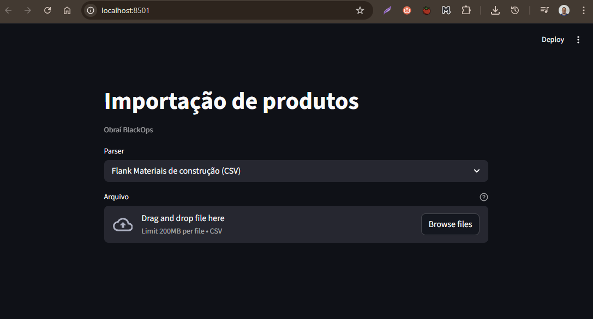

# Obraí BlackOps — Importação de produtos

Ferramenta Python para **importar produtos** de múltiplos fornecedores para o marketplace **Obraí**. Cada fornecedor pode mandar arquivos em **formato diferente**; cada combinação fornecedor + formato tem um **parser** dedicado.

## Objetivo

**Arquivo do fornecedor → tabela no navegador** para conferência (evolução futura: revisão, envio ao Obraí).

## Como funciona

1. Na interface você escolhe o **parser** (fornecedor/formato).
2. Envia o arquivo (**drag and drop** ou clique).
3. O parser lê o arquivo e os dados aparecem em uma **tabela** na mesma tela.
4. Opcional: **Salvar no banco** (SQLite em `data/obrai.db`). No menu lateral **Importações** há a tabela de lotes, detalhe por lote, produtos, excluir e status Obraí.

Parsers ficam em **`fornecedores/`** e são registrados em **`parsers_registry.py`**. O banco usa duas tabelas alinhadas ao Prisma: **`importacoes`** (data, nome, parser, etc.) e **`produtos`** (Product + SupplierProduct, com `importacao_id`).

## Estrutura do repositório

```
obrai-blackops-products/
├── README.md
├── example_view.png
├── fornecedores/           # Parsers por fornecedor/formato
│   ├── README.md
│   ├── flank_materiais_csv.py
│   ├── madelar_produtos_pdf.py
│   └── ...
├── db/                     # SQLite (schema + repo + mappers)
│   ├── schema.sql          # importacoes + produtos
│   ├── connection.py
│   ├── repo.py
│   └── mappers.py
├── data/                   # obrai.db (gerado, no .gitignore)
├── layout.py               # Sidebar compartilhado
├── pages/                  # Multipage: um .py por tela
│   ├── 1_Importar.py
│   └── 2_Importacoes.py
├── fixtures/
├── .streamlit/config.toml
├── app.py                  # Home
├── parsers_registry.py
└── requirements.txt
```

## Requisitos

- Python 3.11+ (recomendado)

### Instalação e execução

```bash
pip install -r requirements.txt
streamlit run app.py
```

No Windows: `py -m streamlit run app.py`

**Hot reload:** `.streamlit/config.toml` com `runOnSave = true`.



### Parser Flank Materiais de construção (CSV)

Colunas: **nome do produto**, **estoque**, **preço**. Exemplo: `fixtures/flank_exemplo.csv`.

### Parser Madelar (PDF)

Tabela extraída com **pdfplumber** (`extract_table`, estratégia `text`). Colunas: Filial, Código, Descrição do Item, Dt. Compra, P. Custo, Compras, Estoque, Vendida, Preço Médio, Méd. Venda Últ. 3m, Tipo Item.

### Enriquecimento com IA (LM Studio)

O script `scripts/enriquecer_importacao.py` usa um servidor local **OpenAI-compatible** (LM Studio) para preencher campos em branco dos produtos (descrição, slug, tags, categoria).

- **Instalar e configurar LM Studio no Windows:** [docs/lm-studio-windows.md](docs/lm-studio-windows.md)

Exemplo: `python scripts/enriquecer_importacao.py 5 --base-url http://localhost:1234/v1 --model Qwen2.5-7B-Instruct` (substitua `5` e `--model` pelo que estiver no seu LM Studio).

## Novo fornecedor

1. Criar módulo em `fornecedores/` (função `parse_*` que devolve `pandas.DataFrame`).
2. Registrar em `parsers_registry.py`.

---

**Obraí** — marketplace estruturado; este repo é a ponte entre arquivos dos parceiros e o catálogo.
