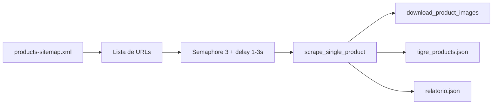

# Plano: `scraper_tigre_produtos.py` (Tigre)

## Contexto do repositório

- O scraper vive na **raiz desta pasta** (`tigre-import/`).
- O monorepo pai (`obrai-blackops-products`) já usa Python com scripts com docstring de uso; o scraper pode seguir o mesmo estilo (shebang, docstring com instalação/uso, `argparse`).

## Arquitetura do script



- **Stack**: `playwright.async_api` + Chromium **headless**, `asyncio`, `tqdm.asyncio` (ou `tqdm` envolvendo o loop com atualização manual), `random.uniform(1, 3)` antes de cada navegação/requisição relevante.
- **Concorrência**: `asyncio.Semaphore(3)` envolvendo o trabalho por produto (incluindo `page.goto` e extração); o delay aleatório entra **dentro** do worker após adquirir o semáforo (ou antes do goto), para respeitar “entre requisições”.
- **User-Agent**: constante realista (string de Chrome recente no Linux ou Windows), aplicada em `browser.new_context(user_agent=...)`.
- **Sitemap**: URL fixa `https://www.tigre.com.br/products-sitemap.xml`.
  - Implementar **`get_product_urls_from_sitemap`** com duas responsabilidades:
    1. **Fetch** com `BrowserContext.request` (ou página dedicada) para herdar UA/cookies e reduzir 403/500 em relação a fetch “nu”.
    2. **Parse** com `xml.etree.ElementTree`: suportar tanto **`urlset`** (`{*}url/{*}loc`) quanto **`sitemapindex`** (seguir sub-sitemaps e agregar URLs). Namespaces XML: usar `tag.endswith("loc")` ou `"{http://www.sitemaps.org/schemas/sitemap/0.9}loc"` de forma tolerante.
  - Deduplicar URLs e ordenar de forma estável (facilita `--limit`).

## Funções modulares (contrato)

| Função | Responsabilidade |
|--------|------------------|
| `get_product_urls_from_sitemap(context, url) -> list[str]` | Baixar XML, expandir index se necessário, retornar lista de URLs de produto. |
| `scrape_single_product(page, url) -> dict` | Retornar um objeto produto no schema abaixo; **nunca** levantar exceção não tratada (capturar, retornar erro ao caller ou `None` + log). |
| `download_image(context, image_url, dest_path: Path) -> None` | Baixar um arquivo (bytes via `context.request.get` com mesmo UA); criar diretórios pais. |
| `download_product_gallery(context, urls: list[str], slug: str, images_dir: Path) -> list[str]` | Para cada URL única em ordem, salvar em `images_dir/products/{slug}/` (`main.jpg`, `02.jpg`, …) e devolver lista de caminhos relativos ao JSON (`products/{slug}/...`). |
| `main()` | CLI, orquestração, tqdm, escrita dos JSONs, métricas de tempo. |

## Extração de campos (estratégia resiliente)

Como o HTML real pode variar, o plano é **heurística em camadas** dentro de `scrape_single_product`:

- **slug**: `urllib.parse.urlparse(url)` → último segmento do `path` → remover `.html` se existir; normalizar para minúsculas se o site usar slug assim (documentar na docstring).
- **`sourceUrl`**: URL absoluta da página do produto no site da Tigre. Preferir o href de `<link rel="canonical">` quando existir e for válido (evita duplicar URLs com query string de campanha); caso contrário usar `page.url` após o carregamento ou a URL da fila já normalizada (`https`, host `www.tigre.com.br` se o site redirecionar de forma consistente).
- **name**: `h1` principal ou `og:title` / `document.title` como fallback.
- **sku**: buscar texto contendo rótulos “Código”, “SKU”, “Referência” (casefold) em tabelas ou `dl/dt/dd`; regex para padrões alfanuméricos com hífen quando necessário.
- **ean**: procurar “EAN”, “GTIN”, “Código de barras”; validar 8/12/13/14 dígitos quando possível.
- **description**: bloco principal de texto (parágrafos), removendo scripts/nav; `get_by_role` ou seletores genéricos com fallback.
- **Galeria de imagens (URLs)**: coletar **todas** as fotos do produto na ordem da galeria (carrossel, miniaturas, `data-src` / `srcset`, links para zoom). Normalizar para URL absoluta, **deduplicar** preservando a ordem (mesma URL em thumb e full não deve duplicar entrada). Se só houver uma imagem, a lista tem um item. Fallback: `og:image` como única foto.
- **mainImage**: continua sendo a **primeira** imagem da galeria (mesmo critério anterior), alinhada ao arquivo `main.jpg`.
- **attributes**: iterar linhas de tabela técnica (`tr` com dois `td` ou `th/td`); mapear para `[{ "attributeKey", "value" }]` com texto limpo (strip, colapsar espaços).
- **preço (opcional)**: se existir preço visível (ex.: texto “R$”), parsear número; senão `retailPrice: null` como no requisito.

**Campos por produto (incluindo link no site)**:

- **`sourceUrl`**: string — URL pública do produto na Tigre (ver extração acima). Incluir em cada item de `products` quando o scrape for bem-sucedido.

**Raiz do JSON**:

- `version`: `1`

**Valores fixos por produto** (como no requisito original):

- `brandId`: `"00000000-0000-0000-0000-000000000000"`
- `primaryCategoryId`: `"00000000-0000-0000-0000-000000000001"`
- `status`: `"active"`
- `supplierProducts`: um item com `supplierBranchId`, `wholesalePrice: null`, `minimumWholesaleQuantity: 1`, `stockQuantity: 999`, `status: "active"`, `retailPrice` preenchido ou `null`.

**Imagens no JSON** (exemplo original preservado + galeria completa):

- **`mainImage`**: string relativa `"products/{slug}/main.jpg"` (primeira foto), alinhada ao arquivo em `output/images/products/{slug}/main.jpg`.
- **`images`**: array de strings com **todos** os caminhos relativos, na ordem da galeria, por exemplo `["products/{slug}/main.jpg", "products/{slug}/02.jpg", "products/{slug}/03.jpg"]`.
- **Nomes no disco**: `main.jpg` para a primeira; demais `02.jpg`, `03.jpg`, … (dois dígitos) para ordenação estável.

Comportamento `--download-images`:

- **ligado**: para cada URL da galeria (lista deduplicada em ordem), baixar para `output/images/products/{slug}/`; preencher `mainImage` (primeiro item) e `images` (lista completa).
- **desligado**: não gravar arquivos; definir `mainImage` e `images` como `null` (evita referências a arquivos inexistentes no import).

**Erros por foto**: se uma URL da galeria falhar ao baixar, registrar no relatório (contagem ou lista) e continuar com as demais; opcionalmente omitir só essa entrada em `images` ou marcar falha no `relatorio.json` por produto.

## Saídas e relatório

- Criar **`output/`** com `Path.mkdir(parents=True, exist_ok=True)`.
- **`output/tigre_products.json`**: `{ "version": 1, "products": [ ... ] }` com UTF-8 e `ensure_ascii=False`, indentação legível.
- **`output/relatorio.json`**: campos mínimos: `total_processados`, `sucesso`, `erros`, `tempo_total_segundos`; opcional útil: `erros_detalhe` (lista de `{url, mensagem}`) para depuração sem poluir stdout.
- **`tqdm`**: barra no processamento da lista (ex.: `asyncio.gather` com updates ou `tqdm.asyncio.tqdm.gather` se disponível na versão instalada).

## CLI

- `python scraper_tigre_produtos.py --limit 30` → processa só os **primeiros N** URLs após deduplicação/ordenação.
- `--download-images` → flag booleana (`store_true`); default **sem** download.
- Opcional pequeno: `--output-dir` para testes (default `output`) — só se não aumentar demais o escopo; caso contrário manter `output` fixo como pedido.

## Cabeçalho do arquivo (instalação)

No topo do script, comentário com:

```bash
pip install playwright tqdm
playwright install chromium
```

## Tratamento de erros

- Try/except por URL em `main`: falha em uma página incrementa `erros` e continua.
- Timeouts explícitos em `page.goto` (ex.: 60s) e retry opcional 1x para timeouts de rede.
- Ao final, sempre escrever `relatorio.json` e `tigre_products.json` (produtos bem-sucedidos apenas no array `products`).

## Validação após implementação

Rodar exatamente como sugerido:

`python scraper_tigre_produtos.py --limit 10 --download-images`

Se seletores não baterem com o HTML real, ajustar apenas os seletores/heurísticas em `scrape_single_product` (escopo mínimo).

## Artefatos

- **[scraper_tigre_produtos.py](../scraper_tigre_produtos.py)** — script principal (quando implementado).
- **[README.md](../README.md)** — como instalar e rodar.
